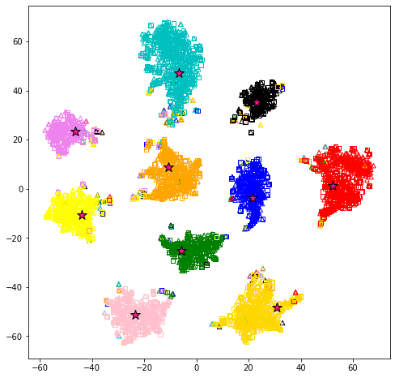

# COXI
Cross-modal Retrieval based on Shared Proxies. (under review) 

## Implementations of COXI

### Prerequest

```
easydict==1.9
h5py
keras==2.8.0
numpy
PyYAML==6.0
scikit-learn==1.0.2
tensorboardX==2.4.1
torch==1.10.1
torchvision==0.11.2
tqdm
```

```bash
pip install -r requirements.txt
```

### dataset

Our experiment uses open source datasets, which can be downloaded from the data homepage.

link:

- Pascal Sentence: https://vision.cs.uiuc.edu/pascal-sentences/
- Wikipedia: http://www.svcl.ucsd.edu/projects/crossmodal/
- NUS-WIDE_10K: https://lms.comp.nus.edu.sg/wp-content/uploads/2019/research/nuswide/NUS-WIDE.html
- XMedia: http://59.108.48.34/tiki/XMediaNet/

For the PKU XMedia dataset, we use the image and text features provided by [XMedia](http://59.108.48.34/tiki/XMediaNet/). 

As for the Pascal Sentence, Wikipedia and NUS-WIDE-10K datasets, we use a 4096-demensional vector extracted by the fc7 layer of VGG-19 to represent each image. For text modality, we use 1000-dimentional bag-of-words (BoW) and 300-dimentional Word2Vec model to extact feature vectors.

We provide the Wikipedia features and lists we used as an example, which can be download from the [here](https://drive.google.com/file/d/1Kf-ew-XHx-48upMBtG6JgnCbkApMibD0/view?usp=sharingAll).

 the feature data and list files should be put in ./COXI/data.

### Run COXI

```python
python main.py --params parameter/wiki.yaml
```

## visulization 
> The visualization results are saved in: [visulization](https://github.com/LigangZheng/COXI/tree/main/visulization)

### Visualization of Wikipedia datasets

The visualisation of learned common space for the Wikipedia dataset by using the t-SNE method. The stars are learned shared proxies. Triangles and squares are image and text modalities respectively. Best viewed in color.


```python
image_co = np.loadtxt('./feature/wikipedia/common_image_all.tsv')
text_co = np.loadtxt('./feature/wikipedia/common_text_all.tsv')
proxy_co = np.loadtxt('./feature/wikipedia/proxy.tsv')
all_co = np.concatenate((image_co, text_co, proxy_co))
label_co = np.loadtxt('./feature/wikipedia/label_all.tsv')
lable_cos = np.concatenate((label_co, label_co))

ts = TSNE(n_components=2, init='pca', random_state=0, metric='cosine', early_exaggeration=50)
t_feat_all = ts.fit_transform(all_co)
```

#### Image samples in the common subspace


```python
color = ['black', 'red', 'gold', 'orange', 'yellow', 'green', 'blue', 'violet', 'pink', 'c']
plt.figure(figsize=(8,8))

for i in range(0, image_co.shape[0]):   
    plt.scatter(t_feat_all[i, 0], t_feat_all[i, 1], edgecolor=color[int(lable_cos[i])], c='none', 
    s=30, marker='^', linewidth=1)
```


    

#### Text samples in the common subspace


```python
color = ['black', 'red', 'gold', 'orange', 'yellow', 'green', 'blue', 'violet', 'pink', 'c']
plt.figure(figsize=(8,8))
for i in range(image_co.shape[0], image_co.shape[0] +text_co.shape[0]):   
    plt.scatter(t_feat_all[i, 0], t_feat_all[i, 1], edgecolor=color[int(lable_cos[i])], c='none', 
    s=30, marker='s', linewidth=1)
```


    

#### Image and text samples in the common subspace


```python

color = ['black', 'red', 'gold', 'orange', 'yellow', 'green', 'blue', 'violet', 'pink', 'c']
plt.figure(figsize=(8,8))

for i in range(0, image_co.shape[0]):   
    plt.scatter(t_feat_all[i, 0], t_feat_all[i, 1], edgecolor=color[int(lable_cos[i])], c='none', 
    s=30, marker='^', linewidth=1)
for i in range(image_co.shape[0], image_co.shape[0] +text_co.shape[0]):   
    plt.scatter(t_feat_all[i, 0], t_feat_all[i, 1], edgecolor=color[int(lable_cos[i])], c='none', 
    s=30, marker='s', linewidth=1)
for i in range(image_co.shape[0] +text_co.shape[0], all_co.shape[0]):   
    plt.scatter(t_feat_all[i, 0], t_feat_all[i, 1], edgecolor='black', c='deeppink', 
    s=150, marker='*', linewidth=1)
```


​    

​    

The network architecture is divided into three parts. Both the image and text branches use two independent fully connected layers to convert the features of the image modality into a 2048-dimensional feature. Subsequently, a common space feature is generated through three layers of fully connected layers with shared weights.
In the experiments of this paper, the batch size is set to 128, and the dimension of the common space is set to 512. Model parameters are optimized using the Adam optimizer, with a learning rate of 1e-4. As for the cross-modal shared proxy loss, parameters are optimized using the SGD optimizer, with a learning rate of 1e-4.
For the Wikipedia dataset, are all set to 1, and the margin is set to 0.5. On the Pascal Sentence dataset, are all set to 1, and the margin is set to 0.2. On the NUS-WIDE-10k dataset, are set to 1, 0.1, 0.1, and the margin is set to 0.1. Finally, on the PKU XMedia and MS COCO datasets, are set to 1, 0.1, 0.01, and the margin is set to 0.5.
# cv-cmy

