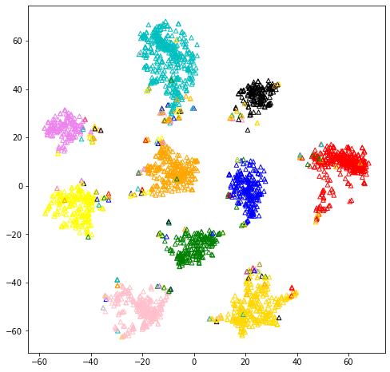
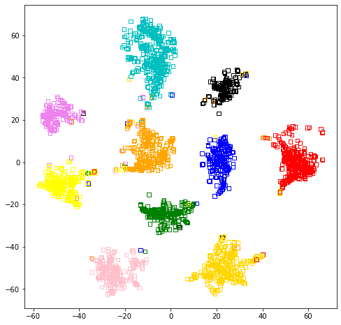
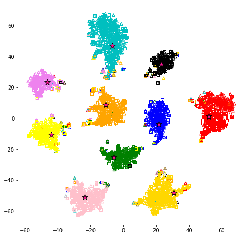

```python
import numpy as np
import matplotlib.pyplot as plt
from sklearn.manifold import TSNE
from scipy.io import loadmat 
```

# Wikipedia
The visualisation of learned common space for the Wikipedia dataset by using the t-SNE method. The stars are learned shared proxies. Triangles and squares are image and text modalities respectively. Best viewed in color.


```python
image_co = np.loadtxt('./feature/wikipedia/common_image_all.tsv')
text_co = np.loadtxt('./feature/wikipedia/common_text_all.tsv')
proxy_co = np.loadtxt('./feature/wikipedia/proxy.tsv')
all_co = np.concatenate((image_co, text_co, proxy_co))
label_co = np.loadtxt('./feature/wikipedia/label_all.tsv')
lable_cos = np.concatenate((label_co, label_co))

ts = TSNE(n_components=2, init='pca', random_state=0, metric='cosine', early_exaggeration=50)
t_feat_all = ts.fit_transform(all_co)
```


### Image samples in the common subspace


```python
color = ['black', 'red', 'gold', 'orange', 'yellow', 'green', 'blue', 'violet', 'pink', 'c']
plt.figure(figsize=(8,8))

for i in range(0, image_co.shape[0]):   
    plt.scatter(t_feat_all[i, 0], t_feat_all[i, 1], edgecolor=color[int(lable_cos[i])], c='none', 
    s=30, marker='^', linewidth=1)
```



    


### Text samples in the common subspace


```python
color = ['black', 'red', 'gold', 'orange', 'yellow', 'green', 'blue', 'violet', 'pink', 'c']
plt.figure(figsize=(8,8))
for i in range(image_co.shape[0], image_co.shape[0] +text_co.shape[0]):   
    plt.scatter(t_feat_all[i, 0], t_feat_all[i, 1], edgecolor=color[int(lable_cos[i])], c='none', 
    s=30, marker='s', linewidth=1)
```



​    


### Image and text samples in the common subspace


```python

color = ['black', 'red', 'gold', 'orange', 'yellow', 'green', 'blue', 'violet', 'pink', 'c']
plt.figure(figsize=(8,8))

for i in range(0, image_co.shape[0]):   
    plt.scatter(t_feat_all[i, 0], t_feat_all[i, 1], edgecolor=color[int(lable_cos[i])], c='none', 
    s=30, marker='^', linewidth=1)
for i in range(image_co.shape[0], image_co.shape[0] +text_co.shape[0]):   
    plt.scatter(t_feat_all[i, 0], t_feat_all[i, 1], edgecolor=color[int(lable_cos[i])], c='none', 
    s=30, marker='s', linewidth=1)
for i in range(image_co.shape[0] +text_co.shape[0], all_co.shape[0]):   
    plt.scatter(t_feat_all[i, 0], t_feat_all[i, 1], edgecolor='black', c='deeppink', 
    s=150, marker='*', linewidth=1)
```


​    

​    

